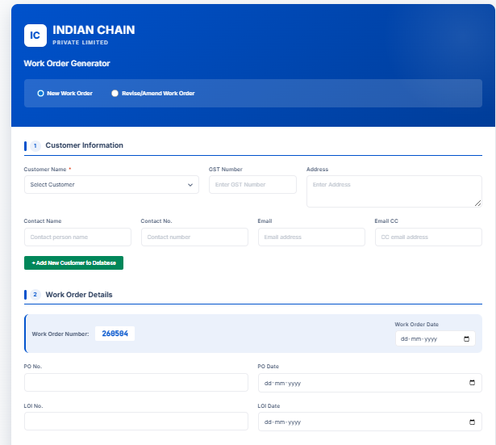
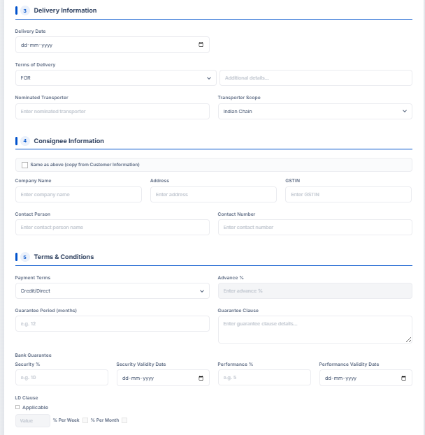

🗂️ Work Order Generator
> A Google Apps Script web application that automates work order creation, management, and printing — built for manufacturing and operations teams.


---
📌 Overview
This tool was built to replace a manual, paper-based work order process at Indian Chain Private Limited. Staff can now fill out a structured web form to generate a work order, which is automatically:
Saved to a Google Sheet as a permanent record
Stored as a PDF in Google Drive
Printed directly from the browser
This eliminates duplicate data entry, reduces errors, and gives management a searchable, centralised log of all work orders.
---
✨ Features
📝 Web Form UI — Clean, easy-to-use form accessible from any browser
📄 Auto PDF Generation — Work order instantly saved as a PDF to Google Drive
📊 Google Sheets Logging — Every submission recorded automatically with timestamp
🖨️ Print-Ready Output — One-click print with formatted layout
🔒 Secure & Private — Runs entirely within your Google Workspace; no external servers
---
🖼️ Screenshots
Form View	Generated Work Order
	
> Additional screenshots: [3.png](3.png) · [4.png](4.png) · [5.png](5.png) · [6.png](6.png)
---
📁 File Structure
```
Work-Order-Generator/
├── code.gs              # Google Apps Script backend (form handling, PDF generation, Sheets logging)
├── index.html           # Frontend web form (HTML + CSS + JS)
├── appsscript.json      # Apps Script project configuration
└── 1.png – 6.png        # Screenshots of the application
```
---
⚙️ How It Works
User opens the deployed web app URL
Fills in the work order form (job details, materials, assigned team, etc.)
On submission, the Apps Script backend:
Writes the data to a Google Sheet
Generates a formatted PDF and saves it to a Google Drive folder
Returns a confirmation with the Work Order number
User can print the work order directly from the browser
---
🚀 Setup & Deployment
Prerequisites
A Google account with access to Google Drive and Google Sheets
Basic familiarity with Google Apps Script (script.google.com)
Steps
Create a new Apps Script project
Go to script.google.com and create a new project
Copy the code
Paste the contents of `code.gs` into the script editor
Create a new HTML file named `index` and paste the contents of `index.html`
Update the constants in `code.gs`:
```javascript
   const SPREADSHEET_ID = 'YOUR_GOOGLE_SHEET_ID';
   const FOLDER_ID      = 'YOUR_GOOGLE_DRIVE_FOLDER_ID';
   ```
Configure the manifest
In the Apps Script editor, go to Project Settings → enable "Show appsscript.json"
Paste the contents of `appsscript.json.txt` into the manifest
Deploy as a Web App
Click Deploy → New Deployment
Type: Web App
Execute as: Me
Who has access: Anyone within your organisation (or Anyone, for wider access)
Click Deploy and copy the URL
---
🛠️ Tech Stack
Layer	Technology
Frontend	HTML5, CSS3, JavaScript
Backend	Google Apps Script (V8 runtime)
Database	Google Sheets
File Storage	Google Drive
PDF Engine	Apps Script `DriveApp` + `DocumentApp`
---
🤝 Contributing
This project is tailored to a specific business workflow, but contributions are welcome. Feel free to fork the repo, adapt it to your use case, and submit a pull request.
---
👤 Author
Avinaba Chakraborty
Senior MIS Analyst · 16+ Years Experience in BI & Data Analytics
LinkedIn · GitHub
---
📄 License
This project is open source and available under the MIT License.
